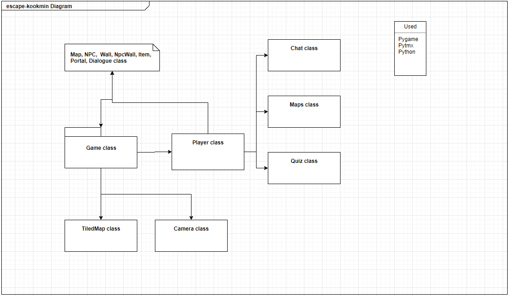

# 소프트웨어 상세 설계서(DDS)
---
## 목차

1. [클래스 명세](#-1.-클래스-명세)

2. [클래스별 상세 명세](#-2.-클래스별-상세-명세)
    - [Chat](#--chat)
    - [Game](#--Game)
    - [Quiz](#--Quiz)
    - [Maps](#--Maps)
    - [Player](#--Player)
    - [NPC](#--NPC)
    - [Wall](#--Wall)
    - [npcWall](#--npcWall)
    - [Item](#--Item)
    - [Portal](#--Portal)
    - [Dialogue](#--Dialogue)
    - [TiledMap](#--TiledMap)
    - [Camera](#--Camera)
      
---
## 1. 클래스 명세

탈국민 게임의 class Diagram

| 클래스 ID | 클래스 이름 | 설명                                                         |
| :-------: | :---------: | ------------------------------------------------------------ |
|  CL - 01  |    Chat     | 게임 내의 채팅창 UI를 담당한다. 채팅창은 플레이어에게 정보를 전달하기 위해 사용된다. |
|  CL - 02  |    Game     | 게임 메인 로직과 시작화면, 프롤로그, 엔딩화면을 담당한다.    |
|  CL - 03  |    Quiz     | 게임 내의 퀴즈 UI와 퀴즈 로직을 담당한다.                    |
|  CL - 04  |    Maps     | 게임 내의 맵 기능 UI를 담당한다.                             |
|  CL - 05  |   Player    | 플레이어 캐릭터를 담당하며                                   |
|  CL - 06  |     NPC     | NPC의 이동과 업데이트를 담당한다.                            |
|  CL - 07  |    Wall     | Wall sprite를 담당한다.                                      |
|  CL - 08  |   npcWall   | npcWall sprite를 담당한다.                                   |
|  CL - 09  |    Item     | Item sprite를 담당하며 Item이 가진 tmx properties의 dialogues를 list로 저장한다 |
|  CL - 10  |   Portal    | Portal sprite를 담당하며 Portal이 가진 tmx properties의 dialogues를 list로 저장한다 |
|  CL - 11  |  Dialogue   | Dialogue sprite를 담당하며  Dialogue가 가진 tmx properties의 dialogues를 list로 저장한다 |
|  CL - 12  |  TiledMap   | tmx형식으로 저장된 map파일을 pygame의 이미지 형식으로 렌더링한다. |
|  CL - 13  |   Camera    | 화면 뷰를 담당한다. |
---
  
## 2. 클래스별 상세 명세
#### - Chat

|                         |     이름      | 역할, 설명                                                   |
| :---------------------: | :-----------: | :----------------------------------------------------------- |
| attributes (properties) |    chatter    | 대화창 UI에서 이름에 들어갈 문자열                           |
|                         |    screen     | 게임화면                                                     |
|                         | backgroundimg | 대화창 UI의 대화창 배경이 될 pygame 이미지                   |
|                         |  chatterimg   | 대화창 UI의 이름 배경이 될 pygame 이미지                     |
|                         |   chatRect    | backgroundimg의 영역                                         |
|                         |  chatterRect  | chatterimg의 영역                                            |
|                         |     font      | 대화창에 그릴 텍스트의 pygame 폰트                           |
|                         |    indexX     | 대화창의 페이지                                              |
|                         |    indexY     | 대화 횟수                                                    |
|                         |   dialogue    | 대화창의 내용이 될 문자열 리스트                             |
|         method          |   drawback    | 대화창 배경을 screen에 그린다.                               |
|                         |  drawchatter  | 대화창 이름 배경을 screen에 그린다.                          |
|                         |   drawText    | 대화창의 텍스트를 설정하고 screen에 그린다.                  |
|                         |   drawchat    | drawchatter, drawback, drawText 메서드를 실행하여 대화창을 화면에 그린다. |
|                         |  hasNextPage  | 더 넘길 대화창이 있는지 판단한다.                            |

---
  
#### - Game

|                         |     이름      | 역할, 설명                                                   |
| :---------------------: | :-----------: | :----------------------------------------------------------- |
| attributes (properties) |    screen    | 게임화면 저장 |
|                         |    rect     | 게임화면 위치 저장 |
|                         | clock | 시간 저장 |
|                         |  mapStage   | 지금 스테이지 list index |
|                         |   beforStage    | 이전 스테이지 list index |
|                         |  paused  | 정지 체크 |
|                         |     mapname      | 스테이지 맵의 이름 |
|                         | shadow | pygame의 크기를 shadow의 크기로 저장 |
|                         |   shadow_mask    | 그림자의 이미지 저장 |
|                         |   shadow_rect    | 그림자의 위치 |
|                         |   all_sprites    | 모든 sprite 저장 |
|                         |   player    | Player 객체 저장 변수 |
|                         | map | TiledMap 객체 저장 |
|                         | map_img | map의 make_map()을 호출하여 렌더링 된 맵 이미지를 저장  |
|                         | map_rect | 맵 이미지의 위치 |
|                         | walls | Wall 객체 sprite Group |
|                         | npcWalls | npcWall 객체 sprite Group |
|                         | items | Item 객체 sprite Group |
|                         | npcs | NPC 객체 sprite Group |
|                         | portals | Portal 객체 sprite Group |
|                         | dialogues | Dialogue 객체 sprite Group |
|                         | camera | Camera 객체 |
|                         | playing | 게임이 진행중인지 확인 |
|                         | dt |  게임의 fps 저장 |
|         method          | load_data | 맵의 이미지와 정보를 불러온다. |
|                         | new | 각 객체별 sprite 그룹을 생성하고 객체에 맞는 sprite를 저장한다. |
|                         | run | event, new, update, draw 메서드를 호출하여 게임의 변화를 체크하고 스테이지와 pause를 확인한다. |
|                         | update | camera와 sprite의 정보를 갱신한다. |
|                         | draw | sprite에 저장된 내용들을 생성하고 그림자를 그리며 카메라를 조정한다. |
|                         | events | 게임의 전체적인 키보드 입력을 처리한다. |
|                         | wait | 키 입력이 들어오기 전까지 pause한다. |
|                         | startscreen | 게임의 시작화면을 띄운다. |
|                         | prologue | 게임 시작 전 프롤로그 스토리를 보여준다. |
|                         | ending | 게임이 끝난 후 엔딩스토리 및 크레딧을 보여준다. |
|                         | render_shadow | 플레이어를 중심으로 빛 효과와 그림자 효과를 준다. |

---
  
#### - Quiz

|                         |     이름      | 역할, 설명                                                   |
| :---------------------: | :-----------: | :----------------------------------------------------------- |
| attributes (properties) | screen | 게임화면 저장 |
|                         | answer | 퀴즈 정답 문자열 |
|                         | enter_img | 정답 입력창 이미지 저장 |
|                         | quiz_img | 퀴즈 문제 이미지 저장 |
|                         | enter_rect | 정답 입력창 위치 |
|                         | quiz_rect | 퀴즈 문제 이미지 위치 |
|                         | font | 정답 입력창 폰트 |
|                         | scorefont | 그 외 폰트 |
|                         | text | 정답 입력창에 그려질 텍스트 |
|                         | current_string | 플레이어가 입력한 텍스트 |
|                         | quizplay | 퀴즈를 푸는중인지 확인 |
|                         | chat | 퀴즈에서 사용될 Chat 객체 |
|                         | solve | 퀴즈를 풀었는지 확인 |
|                         | dialogue | Chat 객체 생성에 사용될 대사 리스트 |
|         method          | drawEnter | 정답 입력창 이미지를 화면에 blit한다. |
|                         | drawQuiz | 퀴즈 문제 이미지를 화면에 blit한다.|
|                         | drawText | 플레이어가 입력한 텍스트를 화면에 blit한다. |
|                         | get_answer | 키보드 입력을 처리한다. |
|                         | isCorrect | 플레이어가 입력한 텍스트가 정답이 맞는지 확인한다. |
|                         | drawCorrect | 플레이어의 정답 여부에 따라 다른 텍스트를 화면에 blit한다. |
|                         | startQuiz | 퀴즈 풀기를 시작한다. |

---
  
#### - Maps
|                         |     이름      | 역할, 설명 |
| :---------------------: | :-----------: | :-------- |
| attributes (properties) | screen | 게임화면 저장 |
|                         | mapnum | 맵 층수 |
|                         | mapimg | 맵 이미지 |
|                         | mapimg_rect | 맵 이미지 위치 |
|                         | rarrow | 오른쪽 화살표 이미지 |
|                         | rarrow_rect | 오른쪽 화살표 이미지 위치 |
|                         | larrow | 왼쪽 화살표 이미지 |
|                         | larrow_rect | 왼쪽 화살표 이미지 위치 |
|                         | showing | 맵을 보고 있는지 확인 |
|         method          | updateMapimg | mapnum에 맞춰 맵 이미지를 업데이트한다. |
|                         | drawMap | 맵 이미지를 화면에 blit한다. |
|                         | drawArrow | mapnum에 맞춰 양쪽 화살표를 알맞게 화면에 blit한다. |
|                         | get_keys | 키보드 입력을 처리한다. |
|                         | showMap | 맵을 보여준다. |

---
  
#### - Player

|                         |     이름      | 역할, 설명                                                   |
| :---------------------: | :-----------: | :----------------------------------------------------------- |
| attributes (properties) |    groups    | all sprite group 저장 |
|                         |    game     | pygame 정보 저장 |
|                         | image | 캐릭터 이미지 저장 |
|                         |  game_folder   | 폴더 위치 설정 |
|                         |   img_folder    | img폴더 위치 설정 |
|                         |  beforKey  | 이전 키값 저장 |
|                         |     rect      | 플레이어의 맵상 위치 저장 |
|                         | vel | 플레이어의 이동 속도별 이동 저장 |
|                         | pos | 플레이어 임시 위치 저장 |
|                         |   Beforpos    | 이전 위치 저장 |
|                         |   screen    | 게임 화면 저장 |
|                         |   map    | 맵 저장 |
|                         |   chat    | chat객체 저장 |
|                         |   chating    | 채팅을 하는지 확인 |
|                         |   mapping    | 맵을 보는지 확인 |
|                         |   Mapstage    | 맵의 스테이지 저장 |
|                         |   stupidDegree    | 아무것도 없는 곳에 클릭했을때 뜰 chat index값 저장 |
|                         |   direction    | 캐릭터가 보는 방향 설치 |
|                         |   posdirection    | 캐릭터의 보는 방향 맵 위치 값 저장 |
|                         |   beformove    | 이전 캐릭터 움직임 저장 |
|                         |   escape    | 탈출할 위치 저장 |
|                         |   move    | 캐릭터가 가만히 있는 시간 저장 |
|                         |   imgname    | 이미지 이름 list index 저장 |
|                         |   stageChk    | 스테이지속 상호작용 횟수 체크 |
|                         | stageDialogue | Dialogue 상호작용 횟수 체크 |
|                         | dialogue | Dialogue chatter 설정 |
|                         | end | 엔딩 여부 확인 |
|                         | keys | 입력되고 있는 키 값 저장 |
|                         | quiz | QUiz 객체 저장 |
|                         | stupicDegree | 아무것도 없는 곳에 상호작용 했을때 나타나는 dialogue의 인덱스 |
|         method          | set_pos | 캐릭터의 위치를 정한다. |
|                         | get_keys | 키보드 입력을 처리하여 캐릭터의 움직임을 조정하고 아이템체크, 탈출, 맵 기능 등을 설정한다. |
|                         | chkdirection | 캐릭터가 바라보는 방향에 따른 이미지로 변환한다. |
|                         | chk_walls | 캐릭터가 움직이기 전 벽이 있는지 확인한다. |
|                         | chk_items | 캐릭터 위치에 아이템이 있는지 확인하고 설정한 정보에 따른 대화창과 모션을 한다. |
|                         | chk_potal | 캐릭터가 포탈에 들어갔는지 확인하고 포탈 조건을 만족하면 해당 맵으로 이동한다. |
|                         | chkdialogue | 맵에 생성된 dialogue를 체크한다. |
|                         | chknpc | npc를 만났는지 확인하고 알맞은 대화창을 띄운다. |
|                         | chatmake | Chat객체를 생성하고 Chat.drawchat 메서드를 호출하여 대화창을 띄운다. |
|                         | update | 캐릭터의 위치, 벽 체크, npc 체크, 포탈 체크, 대화창 체크를 한다. |

---
  
#### - NPC

|             |   이름   | 역할, 설명 |
| :---------------------: | :-----------: | :-------- |
| attributes (properties) | groups | all sprite group 저장 |
|                         | game | Game 객체 저장 |
|                         | name | 생성자 매개변수로 들어온 tmx의 type값 저장 |
|                         | game_folder | 폴더 위치 설정 |
|                         | img_folder | 이미지 폴더 위치 설정 |
|                         | image | NPC 이미지 저장 |
|                         | rect | image 위치 저장 |
|                         | pos | npc 임시 위치 저장 |
|                         | vel | npc의 이동속도별 위치 저장 |
|                         | sleep | npc의 처음 움직임을 멈출때 사용 |
|                         | chk | npc에 상호작용을 하여 체크를 할 일이 있을때 사용 |
|                         | direction | NPC가 바라보는 방향 설정 |
|                         | pause | npc가 멈췄는지 확인 |
|         method          | chk_walls | npc가 npc벽에 닿았는지 체크하고 그에 따른 변화를 준다. |
|                         | chkmove | npc의 움직임을 제어한다. |
|                         | npckill | npc를 제거한다. |
|                         | npcpause | npc를 멈춘다. |
|                         | update | npc의 움직임과 벽을 체크하여 갱신한다. |

---
  
#### - Wall

|             |   이름   | 역할, 설명 |
| :---------------------: | :-----------: | :-------- |
| attributes (properties) | groups | all sprite group 저장 |
|                         | game | Game 객체 저장 |
|                         | rect | 생성자 매개변수로 들어온 값에 따라 위치를 저장 |
|                         | hit_rect | rect값 저장 |
|                         | x | 위치의 왼쪽 위 x값 |
|                         | y | 위치의 왼쪽 위 y값 |

---
  
#### - npcWall

|             |   이름   | 역할, 설명 |
| :---------------------: | :-----------: | :-------- |
| attributes (properties) | groups | all sprite group 저장 |
|                         | game | Game 객체 저장 |
|                         | rect | 생성자 매개변수로 들어온 값에 따라 위치를 저장 |
|                         | hit_rect | rect값 저장 |
|                         | x | 위치의 왼쪽 위 x값 |
|                         | y | 위치의 왼쪽 위 y값 |

---
  
#### - Item

|             |   이름   | 역할, 설명 |
| :---------------------: | :-----------: | :-------- |
| attributes (properties) | groups | all sprite group 저장 |
|                         | game | Game 객체 저장 |
|                         | rect | 생성자 매개변수로 들어온 값에 따라 위치를 저장 |
|                         | hit_rect | rect값 저장 |
|                         | x | 위치의 왼쪽 위 x값 |
|                         | y | 위치의 왼쪽 위 y값 |
|                         | properties | 생성자 매개변수로 들어온 tmx의 properties를 딕셔너리로 저장 |
|                         | dialoguelist | Item이 가지고 있는 대사 리스트 |
|                         | dialogue_length0 | 첫번째 대화 시의 대사 리스트 길이 |
|                         | dialogue_length1 | 두번째 대화 시의 대사 리스트 길이 |
|         method          | make_dialogue | properties를 이용하여 dialoguelist에 대화를 저장한다. |
|                         | update | 아이템의 위치를 갱신한다. |

---
  
#### - Portal

|             |   이름   | 역할, 설명 |
| :---------------------: | :-----------: | :-------- |
| attributes (properties) | groups | all sprite group 저장 |
|                         | type | 생성자 매개변수로 들어온 tmx의 type값 저장 |
|                         | game | Game 객체 저장 |
|                         | rect | 생성자 매개변수로 들어온 값에 따라 위치를 저장 |
|                         | hit_rect | rect값 저장 |
|                         | x | 위치의 왼쪽 위 x값 |
|                         | y | 위치의 왼쪽 위 y값 |
|                         | properties | 생성자 매개변수로 들어온 tmx의 properties를 딕셔너리로 저장 |
|                         | dialoguelist | Item이 가지고 있는 대사 리스트 |
|                         | dialogue_length0 | 첫번째 대화 시의 대사 리스트 길이 |
|                         | dialogue_length1 | 두번째 대화 시의 대사 리스트 길이 |
|         method          | make_dialogue | properties를 이용하여 dialoguelist에 대화를 저장한다. |

---
  
#### - Dialogue

|             |   이름   | 역할, 설명 |
| :---------------------: | :-----------: | :-------- |
| attributes (properties) | groups | all sprite group 저장 |
|                         | game | Game 객체 저장 |
|                         | rect | 생성자 매개변수로 들어온 값에 따라 위치를 저장 |
|                         | hit_rect | rect값 저장 |
|                         | x | 위치의 왼쪽 위 x값 |
|                         | y | 위치의 왼쪽 위 y값 |
|                         | properties | 생성자 매개변수로 들어온 tmx의 properties를 딕셔너리로 저장 |
|                         | dialoguelist | Item이 가지고 있는 대사 리스트 |
|                         | dialogue_length0 | 첫번째 대화 시의 대사 리스트 길이 |
|                         | dialogue_length1 | 두번째 대화 시의 대사 리스트 길이 |
|         method          | make_dialogue | properties를 이용하여 dialoguelist에 대화를 저장한다. |

---
  
#### - TiledMap

|             |   이름   | 역할, 설명 |
| :---------------------: | :-----------: | :-------- |
| attributes (properties) | width | 맵의 가로길이 |
|                         | height | 맵의 세로길이 |
|                         | tmxdata | pytmx로 로드한 맵 정보 |
|         method          | render | 맵을 화면에 그린다. |
|                         | make_map | render 메서드를 호출하여 화면에 맵을 생성한다. |

----
  
#### - Camera

|             |   이름   | 역할, 설명 |
| :---------------------: | :-----------: | :-------- |
| attributes (properties) | camera | 카메라 뷰의 위치 |
|                         | width | 카메라 뷰의 가로길이 |
|                         | height | 카메라 뷰의 세로길이 |
|         method          | apply | 카메라의 왼쪽 상단 위치를 이용하여 변화 |
|                         | apply_rect | 카메라의 왼쪽 상단 위치를 이용하여 변화 |
|                         | update | 카메라 위치를 갱신한다. |
