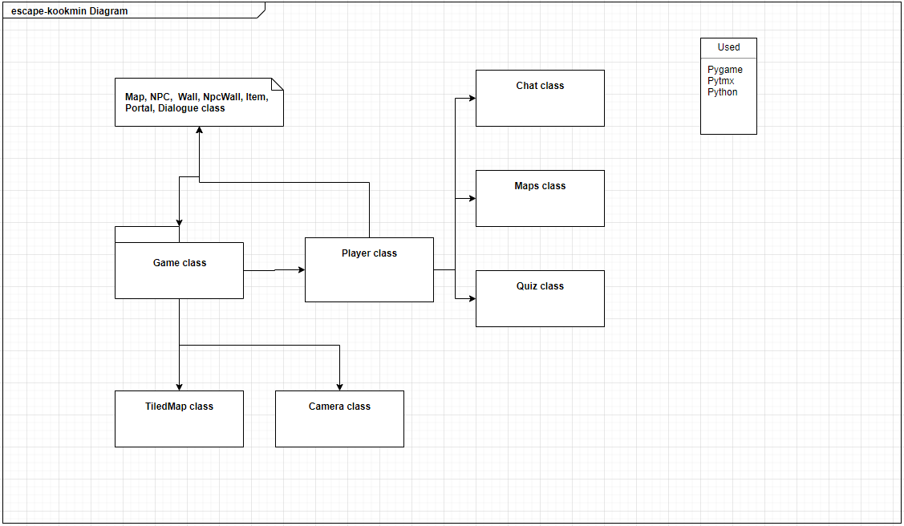

# 최종보고서

## 조원
|  이름  |   학번    | github ID |
| :----: | :-------: | :-------: |
| 고강현 |   2019    | rhrkd1020 |
| 김민정 | 201991556 | minjj0905 |
gitrep : https://github.com/rhrkd1020/Escape-Kookmin
---
  
## 주제
> python 언어를 사용한 탈출 게임   국민대 정문에서 조형물로 야간근무를 한 쿠민이는 퇴근시간이 되어 집에 갈 준비를 하러 웰니스 센터의 샤워실로 향한다. 즐겁게 샤워를 하던 도중 갑자기 불이 꺼지게 되는데... 과연 쿠민이는 무사히 집에 갈 수 있을까?

---
  
## 제작동기
> ad프로젝트로 게임을 개발하고자 했는데 학교 배경의 게임이 아무래도 친숙하니 흥미를 끌수 있지 않을까 해서 시작했다. (말좀 고쳐주삼)

---
  
# 요구사항명세서(SRS)
---
## 기능적 요구사항
---
    1. 캐릭터는 상하좌우로 이동할 수 있어야한다.
    2. 캐릭터가 바라보는 방향에 맞게 이미지가 변경되어야 한다.
    3. 상호작용 키를 누르면 아이템에 설정된 대화창이 떠야 한다.
    4. portal에 다가가면 다른 맵으로 이동해야 한다.
    5. npc가 있어야 하며 상호작용키를 통해 대화를 나눠야 한다.
    6. npc가 설정된 움직임으로 움직여야한다.
    7. 아이템위치가 이동이 되야한다.
    8. 일정 아이템을 누르면 다른 곳이 열리는 등 상호작용이 이루어져야한다.
    9. 어떤 아이템은 퀴즈를 풀수있게 해야한다.
    10. 퀴즈를 푸는 아이템을 누르면 문제가 나오고 답을 입력할 수 있어야한다.
    11. 답을 입력했을때 정답인지 오답인지 확인해야한다.
    12. 정답과 오답일때 따로 다른 부분과 상호작용 해야한다.
    13. 아이템과 상호작용을 할때 소리가 나야한다.
    14. 상호작용의 종류에 따라 소리가 다르게 나야한다.
    15. 맵과 체팅창이 뜰때 캐릭터가 움직이면 안된다.
    16. npc와 부딪치면 캐릭터가 뒤로 물러서야한다.
    17. 열리지 않은 포탈에 가까이 가면 뒤로 물러나야한다.
    18. 포탈의 종류에 따라 이동하는 맵이 달라야한다.

## 사용자 인터페이스 요구사항
---
    게임의 사용자 인터페이스를 구성하는 요소는 다음과 같다.
    1. 시작화면
    2. 프롤로그
    3. 캐릭터
    4. 대화창
    5. 아이템
    6. 소리
    7. 엔딩
    8. npc
    9. 퀴즈
    10. 맵
    
## 비기능적 요구사항
    1. 이 소프트웨어의 구현에는 Python, Pygame, Pytmx 를 이용한다.
    2. 게임의 실행에서 반응 시간은 60fps이다.

---
  

# 소프트웨어 구조설계서(ADS)
---
## 목차

- main.py
- game.py
- sprites.py
- tilemap.py
- chat.py
- settings.py
- quiz.py
- showmap.py
- sound.py

---
  
#### - [main.py](https://github.com/rhrkd1020/Escape-Kookmin/blob/master/%ED%83%88%EA%B5%AD%EB%AF%BC/main.py)

game객체를 생성하고 프롤로그와 시작화면을 띄운다.
 

  

#### - [game.py](https://github.com/rhrkd1020/Escape-Kookmin/blob/master/%ED%83%88%EA%B5%AD%EB%AF%BC/game.py)

| 클래스 | 메서드 | 입력인자 | 출력인자 | 기능 |
| ---- | ---- | ---- | ---- | ---- |
| Game | `__init__` | - | - | 스크린, 스테이지, 믹서의 초기값을 설정해준다. |
|  | `load_data` | - | - | 맵의 이미지와 정보를 불러온다. |
|  | `new` | - | - | 종류별 sprite그룹을 생성하고 종류에 맞는 sprite를 저장한다. |
|  | `run` | - | - | event, new, update, draw 메서드를 호출 하여 게임의 변화를 체크하고 스테이지 확인과 pause확인을 한다. |
|  | `update` | - | - | camera와 sprtie의 정보를 갱신한다. |
|  | `draw` | - | - | sprite에 저장된 것들을 생성하고 그림자를 그리며 카메라를 조정한다. |
|  | `events` | - | - | 게임의 전체적인 키 동작을 처리한다. |
|  | `wait` | - | - | 키 입력이 들어오기 전까지 pause시킨다. |
|  | `startscreen` | - | - | 게임의 첫 화면을 띄워준다. |
|  | `prologue` | - | - | 시작하기전 전반적인 스토리를 설명해준다. |
|  | `ending` | - | - | 게임이 끝나면 엔딩 스토리와 크레딧을 띄워준다. |
|  | `render_shadow` | - | - | 게임화면에 그림자효과와 빛효과를 띄워준다. |
---
  
#### - [sprites.py](https://github.com/rhrkd1020/Escape-Kookmin/blob/master/%ED%83%88%EA%B5%AD%EB%AF%BC/sprites.py)

| 클래스 | 메서드 | 입력인자 | 출력인자 | 기능 |
| ---- | ---- | ---- | ---- | ---- |
| Player | `__init__` | game, x, y, screen, stage | - | class 객체를 선언시 class의 초기값을 정의 한다. |
|  | `set_pos` | - | - | 캐릭터의 위치를 정해준다. |
|  | `get_keys` | - | - | 캐릭터의 움직임을 조정하는 키 값과 아이템 체크, 탈출, 맵키 등 게임속 전체적인 키값을 설정한다. |
|  | `chkdirection` |  | - | 캐릭터가 바라보는 방향에 따른 이미지로 변환해준다. |
|  | `chk_walls` | dir | - | 캐릭터가 움직이기전 벽이 있는지 체크한다. |
|  | `chk_items` | - | - | 아이템 상호작용 키가 눌렸을 때 그 자리에 아이템이 있는지 확인해주고 설정한 정보에 따른 대화창과 모션을 한다. |
|  | `chk_potal` | - | - | 캐릭터가 포탈에 들어갔는지를 확인해주고 그 위치로 이동시킨다. |
|  | `chkdialogue` | - | - | 게임의 대화창을 체크해준다. |
|  | `chknpc` | - | - | 상호작용키를 눌렀을 때 npc를 만났는지 체크해주고 그에 맞는 대화창을 띄워준다. |
|  | `chatmake` | dialogue, num, name='' | - | 채팅창을 띄울때 들어가는 정보들을 매개변수로 받고 그 속성을 가진 객체를 만들어 대화창을 띄운다. |
|  | `update` | - | - | 캐릭터의 위치, 벽체크, npc 체크, 포탈 체크, 대화창 체크를 하게 하는 매서드이다. |
| Npc | `__init__` | game, x, y, type | - | class 객체를 선언시 class의 속성을 정의 한다. |
|  | `chk_walls` | - | - | npc가 npc벽에 닿았는지 체크하고 그에 따른 변화를 준다. |
|  | `chkmove` | - | - | npc의 움직임을 제어한다. |
|  | `npckill` | - | - | npc를 제거한다. |
|  | `npcpause` | - | - | npc를 멈춘다. |
|  | `update` | - | - | npc의 움직임, 벽확인 등을 체크하게 하는 매서드이다. |
| Wall | `__init__` | game, x, y, w, h | - | class 객체를 선언시 class의 속성을 정의 한다. |
| npcWall | `__init__` |  game, x, y, w, h | - | class 객체를 선언시 class의 속성을 정의 한다. |
| Item | `__init__` | game, type, x, y, w, h, properties | - | class 객체를 선언시 class의 속성을 정의 한다. |
|  | `make_dialogue` | - | - | tmx에서 properties를 입력받아 멤버 리스트에 대화를 저장한다. |
|  | `update` | - | - | 아이쳄의 위치를 업데이트한다. |
| Portal | `__init__` | game, type, x, y, w, h, properties | - | class 객체를 선언시 class의 속성을 정의 한다. |
|  | `make_dialogue` | - | - | tmx에서 properties를 입력받아 멤버 리스트에 대화를 저장한다. |
| Dialogue | `__init__` | game, type, x, y, w, h, properties | - | class 객체를 선언시 class의 속성을 정의 한다. |
|  | `make_dialogue` | - | - | tmx에서 properties를 입력받아 멤버 리스트에 대화를 저장한다. |
---
  
#### - [tilemap.py](https://github.com/rhrkd1020/Escape-Kookmin/blob/master/%ED%83%88%EA%B5%AD%EB%AF%BC/tilemap.py)

| 클래스 | 메서드 | 입력인자 | 출력인자 | 기능 |
| ---- | ---- | ---- | ---- | ---- |
| TileMap | `__init__` | filename | - | class 객체를 선언시 class의 속성을 정의 한다. |
|  | `render` | surface | - | 맵을 화면에 bilt해준다. |
|  | `make_map` |  | - | 맵을 만들어준다. |
| Camera | `__init__` | width, height | - | class 객체를 선언시 class의 속성을 정의 한다. |
|  | `apply` | entity | entity.rect.move(self.camera.topleft) | 입력받은 entity의 위치를 카메라의 좌측상단을 이용하여 변화 |
|  | `apply_rect` | rect | rect.move(self.camera.topleft) | 입력받은 rect를 카메라의 좌측상단을 이용하여 변화 |
|  | `update` | target | - | 카메라의 위치 변경과 카메라가 맵밖에 나가지 않았는지를 설정해준다. |
---
  
#### - [chat.py](https://github.com/rhrkd1020/Escape-Kookmin/blob/master/%ED%83%88%EA%B5%AD%EB%AF%BC/chat.py)

| 클래스 | 메서드 | 입력인자 | 출력인자 | 기능 |
| ---- | ---- | ---- | ---- | ---- |
| Chat | `__init__` | screen, dialogue, index=0, chat='' | - | class 객체를 선언시 class의 속성을 정의 한다. |
|  | `drawback` | - | - | 채팅 배경 이미지를 게임 스크린에 그린다. |
|  | `drawchatter` | - | - | 채팅 이름 이미지를 게임 스크린에 그린다.
|  | `drawText` | - | - | 채팅 내용을 게임 스크린에 그린다. |
| | `drawchat` | - | - | `drawchatter`, `drawback`, `drawText` 메서드를 실행하여 스크린에 그려낸다. |
|  | `hasNextPage` | - | boolean | 더 보여줄 dialogue가 남아있는지 판단한다. |

---
  

#### - [settings.py](https://github.com/rhrkd1020/Escape-Kookmin/blob/master/%ED%83%88%EA%B5%AD%EB%AF%BC/settings.py)

 게임의 상수를 정의한다.

  

#### - [quiz.py](https://github.com/rhrkd1020/Escape-Kookmin/blob/master/%ED%83%88%EA%B5%AD%EB%AF%BC/quiz.py)

| 클래스 | 메서드 | 입력인자 | 출력인자 | 기능 |
| ---- | ---- | ---- | ---- | ---- |
| Quiz | `__init__` | screen, game, quizanswer, dialogue | - | class 객체를 선언시 class의 속성을 정의 한다. |
|  | `drawEnter` | - | - | 정답 입력창 이미지를 화면에 그린다. |
|  | `drawQuiz` | - | - | 퀴즈 문제 이미지를 화면에 그린다. |
|  | `drawText` | - | - | 플레이어가 입력한 텍스트를 화면에 그린다. |
|  | `get_answer` | - | - | 키보드 입력을 처리한다. |
|  | `isCorrect` | - | - | 플레이어가 입력한 텍스트가 정답인지 확인한다. |
|  | `drawCorrect` | - | - | 플레이어의 정답 여부에 따라 다른 텍스트를 화면에 그린다. |
|  | `startQuiz` | - | - | 퀴즈 풀기를 시작한다. |

---
  
#### - [showmap.py](https://github.com/rhrkd1020/Escape-Kookmin/blob/master/%ED%83%88%EA%B5%AD%EB%AF%BC/showmap.py)

| 클래스 | 메서드 | 입력인자 | 출력인자 | 기능 |
| ---- | ---- | ---- | ---- | ---- |
| Maps | `__init__` | screen, index=0 | - | class 객체를 선언시 class의 속성을 정의 한다. |
|  | `updateMapimg` | - | - | 맵 층수에 따라 맵 이미지를 업데이트한다. |
|  | `drawMap` | - | - | 맵 이미지를 화면에 그린다. |
|  | `drawArrow` | - | - | 좌측, 우측 화살표를 화면에 그린다. |
|  | `get_keys` | - | - | 키보드 입력을 처리한다. |
|  | `showMap` | - | - | 맵 보기를 시작한다. |

---
  
#### - [sound.py](https://github.com/rhrkd1020/Escape-Kookmin/blob/master/%ED%83%88%EA%B5%AD%EB%AF%BC/sound.py) 

| 클래스 | 메서드 | 입력인자 | 출력인자 | 기능 |
| ---- | ---- | ---- | ---- | ---- |
|  | `set_music` | filename, volume=0.5 | - | 파일이름에 맞는 노래를 설정해준다. |
| | `set_sfx` | filename, volume=0.5 | - | 파일이름에 맞는 효과음을 설정해준다.  |
---

---
  
# 소프트웨어 상세 설계서(DDS)
---
## 목차

1. [클래스 명세](#-1.-클래스-명세)

2. [클래스별 상세 명세](#-2.-클래스별-상세-명세)
    - [Chat](#--chat)
    - [Game](#--Game)
    - [Quiz](#--Quiz)
    - [Maps](#--Maps)
    - [Player](#--Player)
    - [NPC](#--NPC)
    - [Wall](#--Wall)
    - [npcWall](#--npcWall)
    - [Item](#--Item)
    - [Portal](#--Portal)
    - [Dialogue](#--Dialogue)
    - [TiledMap](#--TiledMap)
    - [Camera](#--Camera)
      
---
## 1. 클래스 명세

탈국민 게임의 class Diagram

| 클래스 ID | 클래스 이름 | 설명                                                         |
| :-------: | :---------: | ------------------------------------------------------------ |
|  CL - 01  |    Chat     | 게임 내의 채팅창 UI를 담당한다. 채팅창은 플레이어에게 정보를 전달하기 위해 사용된다. |
|  CL - 02  |    Game     | 게임 메인 로직과 시작화면, 프롤로그, 엔딩화면을 담당한다.    |
|  CL - 03  |    Quiz     | 게임 내의 퀴즈 UI와 퀴즈 로직을 담당한다.                    |
|  CL - 04  |    Maps     | 게임 내의 맵 기능 UI를 담당한다.                             |
|  CL - 05  |   Player    | 플레이어 캐릭터를 담당하며                                   |
|  CL - 06  |     NPC     | NPC의 이동과 업데이트를 담당한다.                            |
|  CL - 07  |    Wall     | Wall sprite를 담당한다.                                      |
|  CL - 08  |   npcWall   | npcWall sprite를 담당한다.                                   |
|  CL - 09  |    Item     | Item sprite를 담당하며 Item이 가진 tmx properties의 dialogues를 list로 저장한다 |
|  CL - 10  |   Portal    | Portal sprite를 담당하며 Portal이 가진 tmx properties의 dialogues를 list로 저장한다 |
|  CL - 11  |  Dialogue   | Dialogue sprite를 담당하며  Dialogue가 가진 tmx properties의 dialogues를 list로 저장한다 |
|  CL - 12  |  TiledMap   | tmx형식으로 저장된 map파일을 pygame의 이미지 형식으로 렌더링한다. |
|  CL - 13  |   Camera    | 화면 뷰를 담당한다. |
---
  
## 2. 클래스별 상세 명세
#### - Chat

|                         |     이름      | 역할, 설명                                                   |
| :---------------------: | :-----------: | :----------------------------------------------------------- |
| attributes (properties) |    chatter    | 대화창 UI에서 이름에 들어갈 문자열                           |
|                         |    screen     | 게임화면                                                     |
|                         | backgroundimg | 대화창 UI의 대화창 배경이 될 pygame 이미지                   |
|                         |  chatterimg   | 대화창 UI의 이름 배경이 될 pygame 이미지                     |
|                         |   chatRect    | backgroundimg의 영역                                         |
|                         |  chatterRect  | chatterimg의 영역                                            |
|                         |     font      | 대화창에 그릴 텍스트의 pygame 폰트                           |
|                         |    indexX     | 대화창의 페이지                                              |
|                         |    indexY     | 대화 횟수                                                    |
|                         |   dialogue    | 대화창의 내용이 될 문자열 리스트                             |
|         method          |   drawback    | 대화창 배경을 screen에 그린다.                               |
|                         |  drawchatter  | 대화창 이름 배경을 screen에 그린다.                          |
|                         |   drawText    | 대화창의 텍스트를 설정하고 screen에 그린다.                  |
|                         |   drawchat    | drawchatter, drawback, drawText 메서드를 실행하여 대화창을 화면에 그린다. |
|                         |  hasNextPage  | 더 넘길 대화창이 있는지 판단한다.                            |

---
  
#### - Game

|                         |     이름      | 역할, 설명                                                   |
| :---------------------: | :-----------: | :----------------------------------------------------------- |
| attributes (properties) |    screen    | 게임화면 저장 |
|                         |    rect     | 게임화면 위치 저장 |
|                         | clock | 시간 저장 |
|                         |  mapStage   | 지금 스테이지 list index |
|                         |   beforStage    | 이전 스테이지 list index |
|                         |  paused  | 정지 체크 |
|                         |     mapname      | 스테이지 맵의 이름 |
|                         | shadow | pygame의 크기를 shadow의 크기로 저장 |
|                         |   shadow_mask    | 그림자의 이미지 저장 |
|                         |   shadow_rect    | 그림자의 위치 |
|                         |   all_sprites    | 모든 sprite 저장 |
|                         |   player    | Player 객체 저장 변수 |
|                         | map | TiledMap 객체 저장 |
|                         | map_img | map의 make_map()을 호출하여 렌더링 된 맵 이미지를 저장  |
|                         | map_rect | 맵 이미지의 위치 |
|                         | walls | Wall 객체 sprite Group |
|                         | npcWalls | npcWall 객체 sprite Group |
|                         | items | Item 객체 sprite Group |
|                         | npcs | NPC 객체 sprite Group |
|                         | portals | Portal 객체 sprite Group |
|                         | dialogues | Dialogue 객체 sprite Group |
|                         | camera | Camera 객체 |
|                         | playing | 게임이 진행중인지 확인 |
|                         | dt |  게임의 fps 저장 |
|         method          | load_data | 맵의 이미지와 정보를 불러온다. |
|                         | new | 각 객체별 sprite 그룹을 생성하고 객체에 맞는 sprite를 저장한다. |
|                         | run | event, new, update, draw 메서드를 호출하여 게임의 변화를 체크하고 스테이지와 pause를 확인한다. |
|                         | update | camera와 sprite의 정보를 갱신한다. |
|                         | draw | sprite에 저장된 내용들을 생성하고 그림자를 그리며 카메라를 조정한다. |
|                         | events | 게임의 전체적인 키보드 입력을 처리한다. |
|                         | wait | 키 입력이 들어오기 전까지 pause한다. |
|                         | startscreen | 게임의 시작화면을 띄운다. |
|                         | prologue | 게임 시작 전 프롤로그 스토리를 보여준다. |
|                         | ending | 게임이 끝난 후 엔딩스토리 및 크레딧을 보여준다. |
|                         | render_shadow | 플레이어를 중심으로 빛 효과와 그림자 효과를 준다. |

---
  
#### - Quiz

|                         |     이름      | 역할, 설명                                                   |
| :---------------------: | :-----------: | :----------------------------------------------------------- |
| attributes (properties) | screen | 게임화면 저장 |
|                         | answer | 퀴즈 정답 문자열 |
|                         | enter_img | 정답 입력창 이미지 저장 |
|                         | quiz_img | 퀴즈 문제 이미지 저장 |
|                         | enter_rect | 정답 입력창 위치 |
|                         | quiz_rect | 퀴즈 문제 이미지 위치 |
|                         | font | 정답 입력창 폰트 |
|                         | scorefont | 그 외 폰트 |
|                         | text | 정답 입력창에 그려질 텍스트 |
|                         | current_string | 플레이어가 입력한 텍스트 |
|                         | quizplay | 퀴즈를 푸는중인지 확인 |
|                         | chat | 퀴즈에서 사용될 Chat 객체 |
|                         | solve | 퀴즈를 풀었는지 확인 |
|                         | dialogue | Chat 객체 생성에 사용될 대사 리스트 |
|         method          | drawEnter | 정답 입력창 이미지를 화면에 blit한다. |
|                         | drawQuiz | 퀴즈 문제 이미지를 화면에 blit한다.|
|                         | drawText | 플레이어가 입력한 텍스트를 화면에 blit한다. |
|                         | get_answer | 키보드 입력을 처리한다. |
|                         | isCorrect | 플레이어가 입력한 텍스트가 정답이 맞는지 확인한다. |
|                         | drawCorrect | 플레이어의 정답 여부에 따라 다른 텍스트를 화면에 blit한다. |
|                         | startQuiz | 퀴즈 풀기를 시작한다. |

---
  
#### - Maps
|                         |     이름      | 역할, 설명 |
| :---------------------: | :-----------: | :-------- |
| attributes (properties) | screen | 게임화면 저장 |
|                         | mapnum | 맵 층수 |
|                         | mapimg | 맵 이미지 |
|                         | mapimg_rect | 맵 이미지 위치 |
|                         | rarrow | 오른쪽 화살표 이미지 |
|                         | rarrow_rect | 오른쪽 화살표 이미지 위치 |
|                         | larrow | 왼쪽 화살표 이미지 |
|                         | larrow_rect | 왼쪽 화살표 이미지 위치 |
|                         | showing | 맵을 보고 있는지 확인 |
|         method          | updateMapimg | mapnum에 맞춰 맵 이미지를 업데이트한다. |
|                         | drawMap | 맵 이미지를 화면에 blit한다. |
|                         | drawArrow | mapnum에 맞춰 양쪽 화살표를 알맞게 화면에 blit한다. |
|                         | get_keys | 키보드 입력을 처리한다. |
|                         | showMap | 맵을 보여준다. |

---
  
#### - Player

|                         |     이름      | 역할, 설명                                                   |
| :---------------------: | :-----------: | :----------------------------------------------------------- |
| attributes (properties) |    groups    | all sprite group 저장 |
|                         |    game     | pygame 정보 저장 |
|                         | image | 캐릭터 이미지 저장 |
|                         |  game_folder   | 폴더 위치 설정 |
|                         |   img_folder    | img폴더 위치 설정 |
|                         |  beforKey  | 이전 키값 저장 |
|                         |     rect      | 플레이어의 맵상 위치 저장 |
|                         | vel | 플레이어의 이동 속도별 이동 저장 |
|                         | pos | 플레이어 임시 위치 저장 |
|                         |   Beforpos    | 이전 위치 저장 |
|                         |   screen    | 게임 화면 저장 |
|                         |   map    | 맵 저장 |
|                         |   chat    | chat객체 저장 |
|                         |   chating    | 채팅을 하는지 확인 |
|                         |   mapping    | 맵을 보는지 확인 |
|                         |   Mapstage    | 맵의 스테이지 저장 |
|                         |   stupidDegree    | 아무것도 없는 곳에 클릭했을때 뜰 chat index값 저장 |
|                         |   direction    | 캐릭터가 보는 방향 설치 |
|                         |   posdirection    | 캐릭터의 보는 방향 맵 위치 값 저장 |
|                         |   beformove    | 이전 캐릭터 움직임 저장 |
|                         |   escape    | 탈출할 위치 저장 |
|                         |   move    | 캐릭터가 가만히 있는 시간 저장 |
|                         |   imgname    | 이미지 이름 list index 저장 |
|                         |   stageChk    | 스테이지속 상호작용 횟수 체크 |
|                         | stageDialogue | Dialogue 상호작용 횟수 체크 |
|                         | dialogue | Dialogue chatter 설정 |
|                         | end | 엔딩 여부 확인 |
|                         | keys | 입력되고 있는 키 값 저장 |
|                         | quiz | QUiz 객체 저장 |
|                         | stupicDegree | 아무것도 없는 곳에 상호작용 했을때 나타나는 dialogue의 인덱스 |
|         method          | set_pos | 캐릭터의 위치를 정한다. |
|                         | get_keys | 키보드 입력을 처리하여 캐릭터의 움직임을 조정하고 아이템체크, 탈출, 맵 기능 등을 설정한다. |
|                         | chkdirection | 캐릭터가 바라보는 방향에 따른 이미지로 변환한다. |
|                         | chk_walls | 캐릭터가 움직이기 전 벽이 있는지 확인한다. |
|                         | chk_items | 캐릭터 위치에 아이템이 있는지 확인하고 설정한 정보에 따른 대화창과 모션을 한다. |
|                         | chk_potal | 캐릭터가 포탈에 들어갔는지 확인하고 포탈 조건을 만족하면 해당 맵으로 이동한다. |
|                         | chkdialogue | 맵에 생성된 dialogue를 체크한다. |
|                         | chknpc | npc를 만났는지 확인하고 알맞은 대화창을 띄운다. |
|                         | chatmake | Chat객체를 생성하고 Chat.drawchat 메서드를 호출하여 대화창을 띄운다. |
|                         | update | 캐릭터의 위치, 벽 체크, npc 체크, 포탈 체크, 대화창 체크를 한다. |

---
  
#### - NPC

|             |   이름   | 역할, 설명 |
| :---------------------: | :-----------: | :-------- |
| attributes (properties) | groups | all sprite group 저장 |
|                         | game | Game 객체 저장 |
|                         | name | 생성자 매개변수로 들어온 tmx의 type값 저장 |
|                         | game_folder | 폴더 위치 설정 |
|                         | img_folder | 이미지 폴더 위치 설정 |
|                         | image | NPC 이미지 저장 |
|                         | rect | image 위치 저장 |
|                         | pos | npc 임시 위치 저장 |
|                         | vel | npc의 이동속도별 위치 저장 |
|                         | sleep | npc의 처음 움직임을 멈출때 사용 |
|                         | chk | npc에 상호작용을 하여 체크를 할 일이 있을때 사용 |
|                         | direction | NPC가 바라보는 방향 설정 |
|                         | pause | npc가 멈췄는지 확인 |
|         method          | chk_walls | npc가 npc벽에 닿았는지 체크하고 그에 따른 변화를 준다. |
|                         | chkmove | npc의 움직임을 제어한다. |
|                         | npckill | npc를 제거한다. |
|                         | npcpause | npc를 멈춘다. |
|                         | update | npc의 움직임과 벽을 체크하여 갱신한다. |

---
  
#### - Wall

|             |   이름   | 역할, 설명 |
| :---------------------: | :-----------: | :-------- |
| attributes (properties) | groups | all sprite group 저장 |
|                         | game | Game 객체 저장 |
|                         | rect | 생성자 매개변수로 들어온 값에 따라 위치를 저장 |
|                         | hit_rect | rect값 저장 |
|                         | x | 위치의 왼쪽 위 x값 |
|                         | y | 위치의 왼쪽 위 y값 |

---
  
#### - npcWall

|             |   이름   | 역할, 설명 |
| :---------------------: | :-----------: | :-------- |
| attributes (properties) | groups | all sprite group 저장 |
|                         | game | Game 객체 저장 |
|                         | rect | 생성자 매개변수로 들어온 값에 따라 위치를 저장 |
|                         | hit_rect | rect값 저장 |
|                         | x | 위치의 왼쪽 위 x값 |
|                         | y | 위치의 왼쪽 위 y값 |

---
  
#### - Item

|             |   이름   | 역할, 설명 |
| :---------------------: | :-----------: | :-------- |
| attributes (properties) | groups | all sprite group 저장 |
|                         | game | Game 객체 저장 |
|                         | rect | 생성자 매개변수로 들어온 값에 따라 위치를 저장 |
|                         | hit_rect | rect값 저장 |
|                         | x | 위치의 왼쪽 위 x값 |
|                         | y | 위치의 왼쪽 위 y값 |
|                         | properties | 생성자 매개변수로 들어온 tmx의 properties를 딕셔너리로 저장 |
|                         | dialoguelist | Item이 가지고 있는 대사 리스트 |
|                         | dialogue_length0 | 첫번째 대화 시의 대사 리스트 길이 |
|                         | dialogue_length1 | 두번째 대화 시의 대사 리스트 길이 |
|         method          | make_dialogue | properties를 이용하여 dialoguelist에 대화를 저장한다. |
|                         | update | 아이템의 위치를 갱신한다. |

---
  
#### - Portal

|             |   이름   | 역할, 설명 |
| :---------------------: | :-----------: | :-------- |
| attributes (properties) | groups | all sprite group 저장 |
|                         | type | 생성자 매개변수로 들어온 tmx의 type값 저장 |
|                         | game | Game 객체 저장 |
|                         | rect | 생성자 매개변수로 들어온 값에 따라 위치를 저장 |
|                         | hit_rect | rect값 저장 |
|                         | x | 위치의 왼쪽 위 x값 |
|                         | y | 위치의 왼쪽 위 y값 |
|                         | properties | 생성자 매개변수로 들어온 tmx의 properties를 딕셔너리로 저장 |
|                         | dialoguelist | Item이 가지고 있는 대사 리스트 |
|                         | dialogue_length0 | 첫번째 대화 시의 대사 리스트 길이 |
|                         | dialogue_length1 | 두번째 대화 시의 대사 리스트 길이 |
|         method          | make_dialogue | properties를 이용하여 dialoguelist에 대화를 저장한다. |

---
  
#### - Dialogue

|             |   이름   | 역할, 설명 |
| :---------------------: | :-----------: | :-------- |
| attributes (properties) | groups | all sprite group 저장 |
|                         | game | Game 객체 저장 |
|                         | rect | 생성자 매개변수로 들어온 값에 따라 위치를 저장 |
|                         | hit_rect | rect값 저장 |
|                         | x | 위치의 왼쪽 위 x값 |
|                         | y | 위치의 왼쪽 위 y값 |
|                         | properties | 생성자 매개변수로 들어온 tmx의 properties를 딕셔너리로 저장 |
|                         | dialoguelist | Item이 가지고 있는 대사 리스트 |
|                         | dialogue_length0 | 첫번째 대화 시의 대사 리스트 길이 |
|                         | dialogue_length1 | 두번째 대화 시의 대사 리스트 길이 |
|         method          | make_dialogue | properties를 이용하여 dialoguelist에 대화를 저장한다. |

---
  
#### - TiledMap

|             |   이름   | 역할, 설명 |
| :---------------------: | :-----------: | :-------- |
| attributes (properties) | width | 맵의 가로길이 |
|                         | height | 맵의 세로길이 |
|                         | tmxdata | pytmx로 로드한 맵 정보 |
|         method          | render | 맵을 화면에 그린다. |
|                         | make_map | render 메서드를 호출하여 화면에 맵을 생성한다. |

----
  
#### - Camera

|             |   이름   | 역할, 설명 |
| :---------------------: | :-----------: | :-------- |
| attributes (properties) | camera | 카메라 뷰의 위치 |
|                         | width | 카메라 뷰의 가로길이 |
|                         | height | 카메라 뷰의 세로길이 |
|         method          | apply | 카메라의 왼쪽 상단 위치를 이용하여 변화 |
|                         | apply_rect | 카메라의 왼쪽 상단 위치를 이용하여 변화 |
|                         | update | 카메라 위치를 갱신한다. |

---
  
## 플레이 화면

<iframe width="640" height="360" src="https://youtu.be/U8MVDeeiPpU" frameborder="0" gesture="media" allowfullscreen=""></iframe>

---
  
## 느낀점

#### 고강현
>  다른분반의 ad 수준과 달리 우리분반의 ad수준은 매우 높다고 생각하였다. 어떤 것을 만들어야 수준이 높은 우리반에서 상위권을 따낼 수 있을까를 생각하였다. 그러다 가장 친숙한 우리 학교를 주제로 만들면 인기 있겠다는 생각을 했다. 그렇게 우리 학교를 바탕으로한 스토리 게임을 제작 하게 되었다. python을 사용하지 않는다면 이러한 게임을 만들어주는 쯔꾸르 메이커나 unity를 사용하여 제작하였겠지만 그러하지 못했다. python으로 모든 작업들을 다 해보는 과정에서 python에 대한 지식이 상당히 늘었고 그러한 지식으로 생각했던 거의 모든 작업을 구현했다. 아쉬운 점은 원래 게임의 동선이나 npc를 더 추가할 계획이었으나 다른 과제, ad, 유레카 대회, 보고서가 겹치면서 시간이 없어 못했다는 점이다. 그리고 8분이었을줄 알았던 발표시간은 4분이었고 기존에는 ppt내용을 모두 설명하고 빠르게 게임 공략을 보여주어 요소들을 다보여줄 생각이었으나 그러지 못한것이 너무 아쉽다. 다시 발표를 할 수 있다면 차라리 ppt를 안보여주고 게임공략을 통해 모든 것을 보여주고싶다. 우리 게임을 얼빗 본다면 그냥 체팅이나 퀴즈 같은 것들은 게임화면 멈추고 이미지 띄우면 되는거 아냐 ? 라던지 간단하게 생각할 수 있다. 하지만 pygame으로 이러한 게임을 만드는 자료들이 많이 없었고 tmx로 만드는 방법도 찾느라 오래걸렸으며 게임을 멈추고 띄우는 과정에도 게임이 멈추는 등 문제가 생겼다. 우리가 만든 게임을 쉽다고 생각 안해줬으면 좋겠다는 마음이다. 아쉬운 마음에 말이 길어졌지만 게임쪽으로 진로를 잡아도 좋겠다고 생각했던 나에게 python으로 게임을 만들어 볼 수 있었던 좋은 경험이었던 것 같다.

#### 김민정
> 이번 ad프로젝트는 구현에 얽매이지 않고 python을 사용한다면 어떤 내용이든 원하는 내용을 구현할 수 있어서 정말 해보고 싶었던 주제로 진행했다. 다행히 조원과 뜻이 잘 맞아 순조롭게 계획을 진행햇으나, 살인적인 2학기 스케줄과 과제, 시험으로 인해 애초에 계획했던 것보다는 범위가 줄어들어서 아쉬운 마음이다. 그래도 무사히 마무리 할 수 있어서 다행이라고 생각하고 개인적으로는 우리 게임이 단순히 ad프로젝트로 그치기엔 아쉬운 작품이라고 생각한다. 많은 사람들이 플레이해주고 즐겨주었으면 좋겠다!
